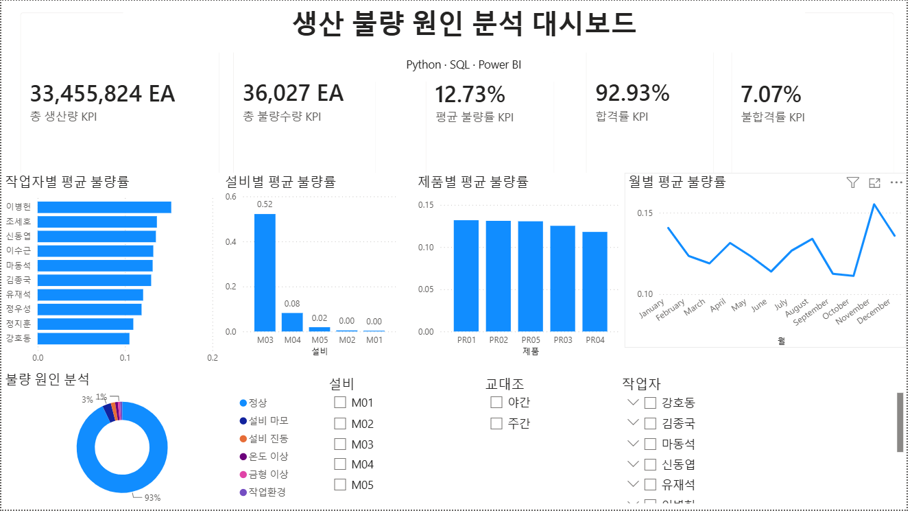

# 제조 불량 원인 분석 대시보드 (Manufacturing Defect Analysis Dashboard)

## 프로젝트 소개

Python을 활용하여 제조 데이터를 직접 생성하고,
SQLite와 SQL을 이용하여 생산 및 품질 데이터를 분석한 후,
Power BI를 통해 제조 불량 원인을 시각화한 데이터 분석 프로젝트입니다.

실제 제조 공정을 가정하여 생산, 품질, 설비, 작업자, 제품 데이터를 생성하였으며,
불량률을 분석하고 주요 원인을 파악할 수 있는 대시보드를 제작하였습니다.

---

## 프로젝트 목적

- 제조 데이터를 직접 생성하여 데이터 분석 프로젝트 수행
- SQL을 활용한 생산 및 품질 데이터 분석
- Power BI를 이용한 KPI 및 대시보드 구축
- 제조 불량 원인 분석을 통한 데이터 기반 의사결정 지원

---

## 사용 기술

|구분| : |기술|

|Language| : |Python 3|
|Library| : |Pandas, Random, Matplotlib|
|Database| : |SQLite|
|Query| : |SQL|
|Visualization| : |Power BI|

---

## 데이터 구성

본 프로젝트에서는 총 5개의 데이터를 생성하였습니다.

데이터 : 설명

Production : 생산 정보
Quality : 품질 검사 정보
Equipment : 설비 정보
Worker : 작업자 정보
Product : 제품 정보

---

## 데이터 생성 규칙

### Production

- 생산건수 : 30,000건
- 생산일시 : 2026년 1년 동안 랜덤 생성
- 설비 : M01 ~ M05
- 제품 : PR01 ~ PR05
- 작업자 : W001 ~ W010
- 생산수량 : 설비 특성에 따라 차등 생성

### Equipment

- 설비별 설치년도
- 설비 상태
- 생산 가능 용량
- 유지보수 주기

### Worker

- 작업자 10명
- 경력
- 팀
- 숙련도

### Quality

- 설비 상태와 작업자 숙련도를 반영하여 불량 확률 생성
- 검사 결과
- 불량 유형
- 불량 원인
- 불량률 계산

---

## 주요 KPI

항목 : 결과

총 생산건수 : 30,000건
총 생산량 : 33,455,824 EA
총 불량수량 : 36,027 EA
평균 불량률 : 12.73%
합격률 : 92.93%
불합격률 : 7.07%

---

## SQL 분석

다음과 같은 분석을 수행하였습니다.

- 설비별 생산량
- 설비별 평균 불량률
- 작업자별 평균 불량률
- 제품별 평균 불량률
- 제품별 불량 유형
- 제품별 불량 원인
- 설비 × 제품 불량률 교차분석
- 설비 × 작업자 × 제품 종합 분석
- KPI 분석

---

## Python 시각화

Matplotlib를 이용하여 다음 그래프를 생성하였습니다.

- 설비별 평균 불량률
- 작업자별 평균 불량률
- 제품별 평균 불량률
- 월별 평균 불량률
- 불량 유형 Top5
- 불량 원인 Top5

---

## Power BI 대시보드

Power BI를 활용하여 다음 내용을 시각화하였습니다.

- KPI 카드
- 설비별 평균 불량률
- 작업자별 평균 불량률
- 제품별 평균 불량률
- 월별 평균 불량률
- 불량 원인 분석
- 슬라이서를 이용한 데이터 필터링

### Dashboard

> `images/dashboard.png` 파일을 업로드한 후 아래 이미지가 표시됩니다.

```markdown

```

---

## 프로젝트 구조

```
manufacturing-defect-dashboard
│
├── Manufacturing.ipynb
├── production.csv
├── quality.csv
├── equipment.csv
├── worker.csv
├── product.csv
├── README.md
└── images
      └── dashboard.png
```

---

## 프로젝트 성과

- Python을 이용한 제조 데이터 생성
- SQLite 데이터베이스 구축
- SQL 기반 KPI 분석
- Python 시각화 구현
- Power BI 대시보드 구축
- 제조 불량 원인 분석 수행

---
